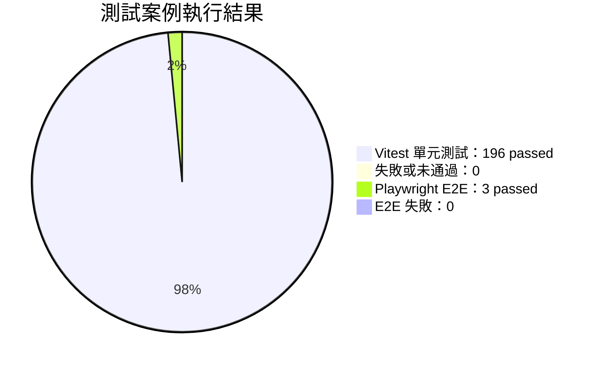
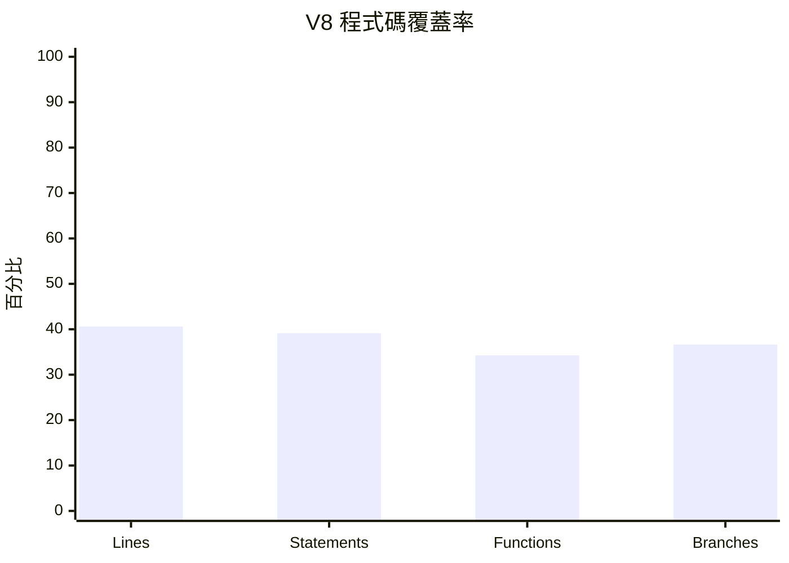
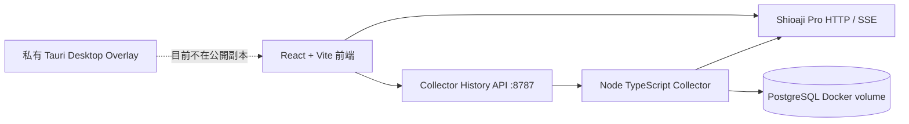
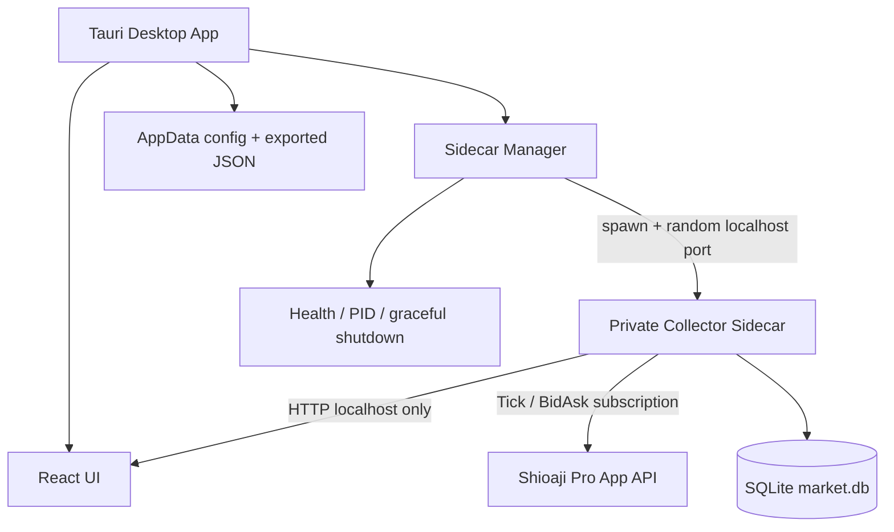

# 測試覆蓋率與 Tauri Sidecar 架構計畫

## 1. 執行摘要

目前前端功能已通過完整單元與瀏覽器端整合測試，包含自訂指標、大單監控、歷史搜尋、K 線 marker 與 JSON 設定檔匯入匯出。測試結果為 **26 個 Vitest 測試檔、196 個單元測試通過**，以及 **3 個 Playwright E2E 案例通過**。

本次另外產生了 V8 程式碼覆蓋率報告。現況的語句覆蓋率為 **39.14%**、行覆蓋率為 **40.61%**、函式覆蓋率為 **34.26%**、分支覆蓋率為 **36.65%**。這些數值與測試通過率不同：測試通過率描述測試是否成功，coverage 描述原始碼有多少執行路徑被測試實際走過。

目前公開前端工作副本沒有 `src-tauri/`、`Cargo.toml` 或 `tauri.conf.json`，因此只能驗證 Vite production build，不能在此副本直接產生 Windows installer。Collector 現況依賴 Docker PostgreSQL；若產品目標是單一 Windows 安裝包，建議把 PostgreSQL 改為 SQLite，並由 Tauri 管理 Collector sidecar 的生命週期。

## 2. 測試狀態視覺化



上圖將兩類測試放在同一張圖中展示總體通過狀態；實際判讀時仍應以各類測試的分項表格為準。

### 2.1 測試總覽

| 測試層級 | 測試檔／案例 | 通過 | 失敗 | 狀態 |
|---|---:|---:|---:|---|
| Vitest 單元測試 | 26 檔／196 案例 | 196 | 0 | 通過 |
| Playwright E2E | 3 案例 | 3 | 0 | 通過 |
| TypeScript／Vite production build | 1 | 1 | 0 | 通過 |
| Vitest V8 coverage 產生 | 1 | 1 | 0 | 報告已產生 |

### 2.2 功能模組狀態

| 功能模組 | 相關測試 | 單元測試 | E2E | Production build | 覆蓋狀態 |
|---|---|---|---|---|---|
| 7SMA、KDJ／背離、關鍵價位 | `private-indicators.test.ts` | 通過 | 間接驗證 | 通過 | 已有核心計算測試，圖表視覺互動仍需補強 |
| 大單門檻、跨越、重置與冷卻 | `private-market.test.ts` | 通過 | 即時跨越通過 | 通過 | 核心規則已覆蓋 |
| 即時大單到 K 線 marker | `large-order.integration.spec.ts` | 間接 | 通過 | 通過 | event stream 與 UI fixture 已覆蓋，Canvas 像素比對尚未加入 |
| 歷史大單搜尋與 marker | `large-order.integration.spec.ts` | API／store 間接 | 通過 | 通過 | 查詢結果與共用 marker stream 已覆蓋 |
| 工作台 localStorage | `large-order-workbench-state.test.ts` | 通過 | 尚未獨立測試重啟流程 | 通過 | 格式與容錯已覆蓋 |
| JSON 設定檔匯入匯出 | `large-order-config.test.ts` | 通過 | 尚未加入檔案選取 UI E2E | 通過 | round-trip、版本與錯誤格式已覆蓋 |
| Collector Tick／五檔資料庫 | Collector 目前沒有專案測試檔 | 未覆蓋 | 未覆蓋 | 不適用 | 應補 integration／contract tests |
| Tauri Rust lifecycle／sidecar | 公開副本沒有 `src-tauri/` | 未覆蓋 | 未覆蓋 | 無法在本副本打包 | 必須在私有 desktop repo 補測試 |

### 2.3 V8 程式碼覆蓋率

| 指標 | 覆蓋 | 總數 | 百分比 |
|---|---:|---:|---:|
| Lines | 945 | 2,327 | **40.61%** |
| Statements | 1,038 | 2,652 | **39.14%** |
| Functions | 221 | 645 | **34.26%** |
| Branches | 648 | 1,768 | **36.65%** |



完整 HTML 報告位於 [`coverage/index.html`](../coverage/index.html)。目前 coverage 指令會在測試結束後留下 Vite server 的非零停機等待，因此終端可能顯示 timeout；測試案例與 coverage artifact 已成功產生，應在 CI 中改用明確的測試 server lifecycle 或 `forceExit` 等方案整理退出行為。

## 3. 現況架構與主要缺口



目前 Collector 需要：

1. 主機上的 Shioaji Pro App 維持登入與 LIVE 狀態。
2. Docker Collector 連線到 `host.docker.internal:21322`。
3. PostgreSQL container 與 persistent volume。
4. 前端透過 `VITE_PRIVATE_HISTORY_BASE` 查詢歷史 API。

這種模式適合開發與驗證，但不符合「新 Windows 電腦只安裝一個產品即可使用」的產品目標。

## 4. 建議的目標架構

### 4.1 產品目標

建議的 Windows 安裝包包含：

- Tauri 主程式與 React 前端。
- Collector sidecar。
- SQLite 本機資料庫檔案。
- Tauri 啟動／停止／健康檢查管理。
- 首次啟動時自動產生資料目錄與設定檔。

Shioaji Pro 原生交易終端仍維持獨立程序，由使用者登入並提供本機 API／SSE。Collector 不保存券商密碼，也不取代交易終端登入流程。



### 4.2 為何建議 SQLite 而不是內嵌 PostgreSQL

PostgreSQL 適合伺服器或多使用者環境，但對單機桌面安裝會引入：

- 額外資料庫程序；
- Windows service 或 container 管理；
- 初始化與升級流程；
- 資料目錄權限與備份複雜度；
- 使用者卸載時的資料保留決策。

SQLite 可以使用單一 `market.db` 檔案保存 Tick 與五檔快照，不需要 Docker 或額外資料庫服務。若未來需要多台終端共用資料，再保留 PostgreSQL 版 Collector 作為 server deployment profile。

## 5. 具體實作步驟

### Phase 0：凍結協定與資料模型

1. 將現有 Collector API contract 固定為版本化介面，例如 `/api/private/v1/depth-alerts`。
2. 定義 `health`、`ready`、`shutdown`、`config` endpoint。
3. 保持目前 Tick、BidAsk、歷史大單輸出欄位相容。
4. 為資料表建立 migration version，例如 `schema_migrations`。
5. 定義 SQLite 索引：`code + event_time`、`code + source_time`、`received_at`。

### Phase 1：Collector storage abstraction

1. 把目前 `db.ts` 拆為 `MarketStore` 介面。
2. 保留 `PostgresMarketStore`，供 Docker/server 模式使用。
3. 新增 `SqliteMarketStore`，提供：
   - Tick 批次寫入；
   - 五檔快照批次寫入；
   - 歷史門檻查詢；
   - transaction 與 WAL mode；
   - 啟動 migration。
4. 為兩個 store 寫同一組 contract tests，確認查詢結果一致。
5. 批次寫入失敗時，先寫本機 bounded queue，避免短暫資料庫鎖定造成行情程序崩潰。

### Phase 2：Collector sidecar packaging

短期可以維持 TypeScript Collector，使用 Node 22 SEA 或受支援的單檔 Node runtime packaging；長期建議將 collector runtime 移植為 Rust sidecar，以減少 Node runtime 與依賴打包風險。

短期步驟：

1. 建立 `private-collector/sea-config.json`。
2. 將 Collector compile 成 `dist/index.js`。
3. 建立 sidecar bootstrap，接收：
   - `SHIOAJI_BASE_URL`；
   - `COLLECTOR_DB_PATH`；
   - `COLLECTOR_PORT=0`；
   - contract subscription JSON。
4. 啟動後在 stdout 印出一行機器可解析訊息：
   `READY port=xxxxx pid=xxxxx`。
5. Tauri 只允許 loopback 連線，禁止 `0.0.0.0`。
6. Windows sidecar 檔名依 Tauri target triple 命名，例如 `collector-x86_64-pc-windows-msvc.exe`。

長期步驟：

1. 以 Rust Tokio／Axum 或 Actix 建立 collector runtime。
2. 使用 `sqlx` 或 `rusqlite` 連接 SQLite。
3. 將 SSE parser、contract normalizer、batch writer 移植並保留既有 API contract。
4. 使用 Rust cross-platform build 產出 Windows sidecar，避免依賴 Node runtime。

### Phase 3：Tauri sidecar manager

在私有 desktop repository 的 `src-tauri` 新增 `sidecar_manager` 模組：

1. 取得 Tauri `appDataDir`，建立：
   ```text
   %APPDATA%/ShioajiPro/private-market/
     market.db
     collector.log
     collector.json
     migrations/
   ```
2. 啟動 sidecar 時使用 random localhost port，避免固定 port 衝突。
3. 傳入 database path、Shioaji API base URL 與 symbol config。
4. 讀取 `READY` 訊息後呼叫 `/health` 與 `/ready`。
5. 將實際 port 注入前端 runtime config，不要在 build time 寫死 `8787`。
6. Collector crash 時採用 bounded restart：例如最多 3 次 exponential backoff，之後顯示明確錯誤。
7. Tauri app close、logout、更新與 OS shutdown 時呼叫 graceful shutdown。
8. 將 collector stdout／stderr 寫入 rolling log，限制單檔大小。

### Phase 4：前端 runtime config 調整

1. 將 `VITE_PRIVATE_HISTORY_BASE` 從固定 build-time URL 改為 runtime discovery。
2. 前端啟動時透過 Tauri command 取得 sidecar port。
3. Browser dev mode 仍允許 `VITE_PRIVATE_HISTORY_BASE` 覆寫。
4. Production Tauri mode 僅使用 localhost sidecar URL。
5. Collector 未 ready 時，工作台顯示「資料收集服務啟動中」而不是一般 API 404。
6. 加入 Collector 連線狀態指示：`starting / ready / degraded / stopped`。

### Phase 5：Tauri installer 與資料升級

1. 私有 repo 補齊 `tauri.conf.json`、Rust toolchain 與 Windows bundle 設定。
2. 在 Windows CI 建置前端、Rust 主程式與 sidecar。
3. 將 sidecar binaries 放進 Tauri externalBin 設定。
4. 產生 MSI 與 NSIS setup.exe。
5. 首次啟動執行 SQLite migration。
6. 更新時先停止舊 sidecar，再替換 binary，最後重新啟動。
7. 只在 migration 成功後切換 schema version。
8. 卸載時提供「保留行情資料」與「刪除行情資料」選項。

## 6. 測試計畫

| 層級 | 必要測試 |
|---|---|
| Store unit | Tick／五檔 insert、批次 flush、門檻查詢、去重、migration |
| Contract | PostgreSQL 與 SQLite 對相同 fixture 回傳相同 API payload |
| Collector integration | mock Shioaji SSE → store → history API |
| Sidecar lifecycle | spawn、READY、health、crash restart、graceful shutdown |
| Frontend integration | runtime port discovery、Collector unavailable、history search、marker rendering |
| Tauri smoke | Windows installer 安裝、首次啟動、重啟後資料保留、升級 migration |
| Security | loopback bind、路徑注入、設定檔驗證、不可將密碼寫入 log |
| Performance | Tick 高峰批次寫入、SQLite WAL、磁碟占用與 retention policy |

## 7. 建議的完成門檻

在宣稱可交付 Windows installer 前，至少應達成：

- 前端 unit tests：所有既有案例通過。
- E2E：即時大單、歷史搜尋、K 線 marker、設定匯入匯出通過。
- 主要 frontend lines／statements coverage 至少 70%。
- Collector store contract coverage 至少 85%。
- Tauri／sidecar lifecycle smoke tests 在 Windows CI 通過。
- 安裝、重啟、更新與資料 migration 均有實機測試記錄。
- Collector 只綁定 loopback，且不在 log 寫入帳號、密碼或 token。

## 8. 本次交付物與限制

本次已產生：

- V8 HTML coverage report；
- JSON 設定匯出／匯入功能；
- 前端整合測試結果；
- Tauri sidecar 與 SQLite 遷移方案。

尚未在本公開工作副本完成：

- Tauri Rust host；
- Windows installer；
- Collector SQLite store；
- Collector sidecar binary；
- Windows 實機安裝測試。

這些項目需要私有 desktop overlay 及 Windows build environment 才能進入實作與最終驗證階段。
